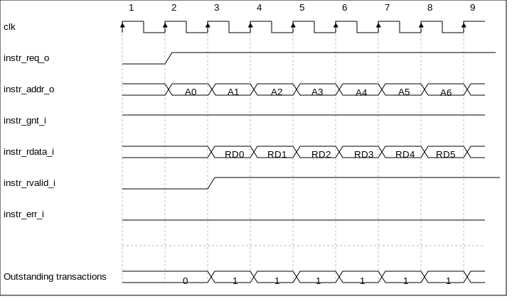
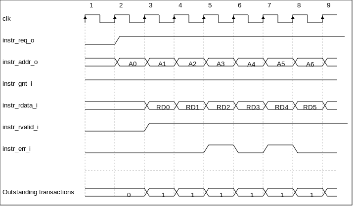
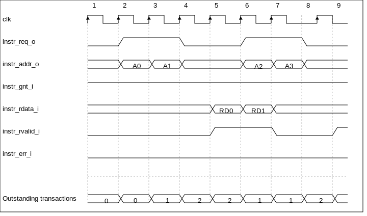
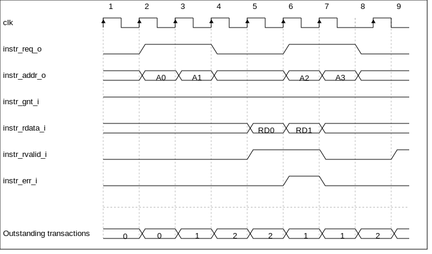

.. _instruction-fetch:

Instruction Fetch
=================

The Instruction Fetch (IF) stage of the |corev| is able to supply one instruction to
the Instruction Decode (ID ) stage per cycle if the external bus interface is able
to serve one instruction per cycle. In case of executing compressed instructions,
on average less than one 32-bit instruction fetch will we needed per instruction
in the ID stage.

For optimal performance and timing closure reasons, a prefetcher is used
which fetches instructions via the external bus interface from for example
an externally connected instruction memory or instruction cache.

The prefetch unit performs word-aligned 32-bit prefetches and stores the
fetched words in an alignment buffer with three entries. As a result of this (speculative)
prefetch, |corev| can fetch up to three words outside of the code region
and care should therefore be taken that no unwanted read side effects occur
for such prefetches outside of the actual code region.

:numref:`Instruction Fetch interface signals` describes the signals that are used to fetch instructions. This
interface is a simplified version of the interface that is used by the
LSU, which is described in :ref:`load-store-unit`. The difference is that no writes
are possible and thus it needs fewer signals.

.. table:: Instruction Fetch interface signals
  :name: Instruction Fetch interface signals

  +----------------------------+-----------------+---------------------------------------------------------------------------------------------------------------------------------------------------+
  | **Signal**                 | **Direction**   | **Description**                                                                                                                                   |
  +----------------------------+-----------------+---------------------------------------------------------------------------------------------------------------------------------------------------+
  | ``instr_req_o``            | output          | Request valid, will stay high until ``instr_gnt_i`` is high for one cycle                                                                         |
  +----------------------------+-----------------+---------------------------------------------------------------------------------------------------------------------------------------------------+
  | ``instr_gnt_i``            | input           | The other side accepted the request. ``instr_addr_o``, ``instr_memtype_o`` and ``instr_prot_o`` may change in the next cycle.                     |
  +----------------------------+-----------------+---------------------------------------------------------------------------------------------------------------------------------------------------+
  | ``instr_addr_o[31:0]``     | output          | Address, word aligned                                                                                                                             |
  +----------------------------+-----------------+---------------------------------------------------------------------------------------------------------------------------------------------------+
  | ``instr_memtype_o[1:0]``   | output          | Memory Type attributes (cacheable, bufferable)                                                                                                    |
  +----------------------------+-----------------+---------------------------------------------------------------------------------------------------------------------------------------------------+
  | ``instr_prot_o[2:0]``      | output          | Protection attributes                                                                                                                             |
  +----------------------------+-----------------+---------------------------------------------------------------------------------------------------------------------------------------------------+
  | ``instr_dbg_o``            | output          | Debug mode access                                                                                                                                 |
  +----------------------------+-----------------+---------------------------------------------------------------------------------------------------------------------------------------------------+
  | ``instr_rvalid_i``         | input           | ``instr_rdata_i`` and ``instr_err_i`` are valid when ``instr_rvalid_i`` is high. This signal will be high for exactly one cycle per request.      |
  +----------------------------+-----------------+---------------------------------------------------------------------------------------------------------------------------------------------------+
  | ``instr_rdata_i[31:0]``    | input           | Data read from memory                                                                                                                             |
  +----------------------------+-----------------+---------------------------------------------------------------------------------------------------------------------------------------------------+
  | ``instr_err_i``            | input           | An instruction interface error occurred                                                                                                           |
  +----------------------------+-----------------+---------------------------------------------------------------------------------------------------------------------------------------------------+

Misaligned Accesses
-------------------

Externally, the IF interface performs word-aligned instruction fetches only.
Misaligned instruction fetches are handled by performing two separate word-aligned instruction fetches.
Internally, the core can deal with both word- and half-word-aligned instruction addresses to support compressed instructions.
The LSB of the instruction address is ignored internally.

Protocol
--------

The instruction bus interface is compliant to the OBI protocol (see [OPENHW-OBI]_ for detailed signal and protocol descriptions).
The |corev| instruction fetch interface does not
implement the following optional OBI signals: we, be, wdata, auser, wuser, aid,
rready, ruser, rid. These signals can be thought of as being tied off as
specified in the OBI specification. The |corev| instruction fetch interface can
cause up to two outstanding transactions.

:numref:`obi-instruction-basic` and :numref:`obi-instruction-multiple-outstanding` show example timing diagrams of the protocol.

   Back-to-back Memory Transactions

   Back-to-back Memory Transactions with bus errors on A2/RD2 and A4/RD4

   Multiple Outstanding Memory Transactions

   Multiple Outstanding Memory Transactions with bus error on A1/RD1
