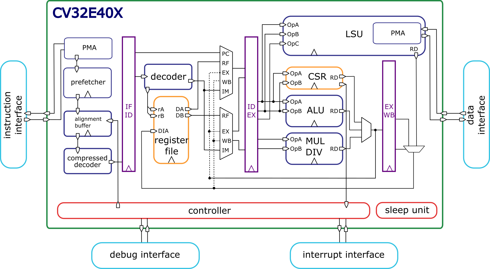

Introduction
=============

|corev| is a 4-stage in-order 32-bit RISC-V
processor core. :numref:`blockdiagram` shows a block diagram of the core.

   Block Diagram of |corev| RISC-V Core

License
-------
Copyright 2020 OpenHW Group.

Copyright 2018 ETH Zurich and University of Bologna.

Copyright and related rights are licensed under the Solderpad Hardware
License, Version 0.51 (the “License”); you may not use this file except
in compliance with the License. You may obtain a copy of the License at
http://solderpad.org/licenses/SHL-0.51. Unless required by applicable
law or agreed to in writing, software, hardware and materials
distributed under this License is distributed on an “AS IS” BASIS,
WITHOUT WARRANTIES OR CONDITIONS OF ANY KIND, either express or implied.
See the License for the specific language governing permissions and
limitations under the License.

Standards Compliance
--------------------

|corev| is a standards-compliant 32-bit RISC-V processor.
It follows these specifications:

.. [RISC-V-UNPRIV] RISC-V Instruction Set Manual, Volume I: User-Level ISA, Document Version 20191213 (December 13, 2019),
   https://github.com/riscv/riscv-isa-manual/releases/download/Ratified-IMAFDQC/riscv-spec-20191213.pdf

.. [RISC-V-PRIV] RISC-V Instruction Set Manual, Volume II: Privileged Architecture, Document Version 20211105-signoff (November 5, 2021),
   https://github.com/riscv/riscv-isa-manual/releases/download/draft-20211105-c30284b/riscv-privileged.pdf

.. [RISC-V-DEBUG] RISC-V External Debug Support, version 1.0.0, 2021-10-07,
   https://github.com/riscv/riscv-debug-spec/blob/master/riscv-debug-stable.pdf

.. [RISC-V-SMCLIC] "Smclic" Core-Local Interrupt Controller (CLIC) RISC-V Privileged Architecture Extension, version 0.9-draft, 12/21/2021,
   https://github.com/riscv/riscv-fast-interrupt/blob/master/clic.pdf

.. [RISC-V-ZBA_ZBB_ZBC_ZBS] RISC-V Bit Manipulation ISA-extensions, Version 1.0.0-38-g865e7a7, 2021-06-28,
   https://github.com/riscv/riscv-bitmanip/releases/download/1.0.0/bitmanip-1.0.0-38-g865e7a7.pdf

.. [RISC-V-ZCA_ZCB_ZCMB_ZCMP_ZCMT] RISC-V Standard Extension for the **Zca**, **Zcb**, **Zcmb**, **Zcmp**, **Zcmt** subsets of **Zc**, v0.70.1, 29f0511 (not ratified yet),
   https://github.com/riscv/riscv-code-size-reduction/releases/download/V0.70.1-TOOLCHAIN-DEV/Zc_0_70_1.pdf

.. [RISC-V-CRYPTO] RISC-V Cryptography Extensions Volume I, Scalar & Entropy Source Instructions, Version v1.0.0, 2'nd December, 2021: Ratified,
   https://github.com/riscv/riscv-crypto/releases/download/v1.0.0-scalar/riscv-crypto-spec-scalar-v1.0.0.pdf

.. [OPENHW-OBI] OpenHW Open Bus Interface (OBI) protocol, version 1.2,
   https://github.com/openhwgroup/core-v-docs/blob/master/cores/obi/OBI-v1.2.pdf

.. [OPENHW-XIF] OpenHW eXtension Interface, revision fa77b73e,
   https://docs.openhwgroup.org/projects/openhw-group-core-v-xif/

.. [SYMBIOTIC-RVFI] Symbiotic EDA RISC-V Formal Interface
   https://github.com/SymbioticEDA/riscv-formal/blob/master/docs/rvfi.md

Many features in the RISC-V specification are optional, and |corev| can be parameterized to enable or disable some of them.

|corev| supports one of the following base integer instruction sets from [RISC-V-UNPRIV]_.

.. list-table:: |corev| Base Instruction Set
   :header-rows: 1

   * - Base Integer Instruction Set
     - Version
     - Configurability

   * - **RV32I**: RV32I Base Integer Instruction Set
     - 2.1
     - optionally enabled with the ``RV32`` parameter

   * - **RV32E**: RV32E Base Integer Instruction Set
     - 1.9 (not ratified yet)
     - optionally enabled with the ``RV32`` parameter

In addition, the following standard instruction set extensions are available from [RISC-V-UNPRIV]_, [RISC-V-ZBA_ZBB_ZBC_ZBS]_, [RISC-V-CRYPTO]_ and [RISC-V-ZCA_ZCB_ZCMB_ZCMP_ZCMT]_.

.. list-table:: |corev| Standard Instruction Set Extensions
   :header-rows: 1

   * - Standard Extension
     - Version
     - Configurability

   * - **C**: Standard Extension for Compressed Instructions
     - 2.0
     - always enabled

   * - **M**: Standard Extension for Integer Multiplication and Division
     - 2.0
     - optionally enabled with the ``M_EXT`` parameter

   * - **Zicntr**: Standard Extension for Base Counters and Timers
     - 2.0
     - always enabled

   * - **Zihpm**: Standard Extension for Hardware Performance Counters
     - 2.0
     - always enabled

   * - **Zicsr**: Control and Status Register Instructions
     - 2.0
     - always enabled

   * - **Zifencei**: Instruction-Fetch Fence
     - 2.0
     - always enabled

   * - **Zca**: Subset of the standard **Zc** Code-Size Reduction extension consisting of a subset of **C** with the FP load/stores removed.
     - v0.70.1 (not ratified yet; version will change)
     - optionally enabled with the ``ZC_EXT`` parameter

   * - **Zcb**: Subset of the standard **Zc** Code-Size Reduction extension consisting of simple operations.
     - v0.70.1 (not ratified yet; version will change)
     - optionally enabled with the ``ZC_EXT`` parameter

   * - **Zcmb**: Subset of the standard **Zc** Code-Size Reduction extension consisting of load/store byte/half which overlap with **c.fld**, **c.fldsp**, **c.fsd**.
     - v0.70.1 (not ratified yet; version will change)
     - optionally enabled with the ``ZC_EXT`` parameter

   * - **Zcmp**: Subset of the standard **Zc** Code-Size Reduction extension consisting of push/pop and double move which overlap with **c.fsdsp**.
     - v0.70.1 (not ratified yet; version will change)
     - optionally enabled with the ``ZC_EXT`` parameter

   * - **Zcmt**: Subset of the standard **Zc** Code-Size Reduction extension consisting of table jump.
     - v0.70.1 (not ratified yet; version will change)
     - optionally enabled with the ``ZC_EXT`` parameter

   * - **A**: Atomic Instructions
     - 2.1
     - optionally enabled with the ``A_EXT`` parameter

   * - **Zba**: Bit Manipulation Address calculation instructions
     - Version 1.0.0
     - optionally enabled with the ``B_EXT`` parameter

   * - **Zbb**: Bit Manipulation Base instructions
     - Version 1.0.0
     - optionally enabled with the ``B_EXT`` parameter

   * - **Zbc**: Bit Manipulation Carry-Less Multiply instructions
     - Version 1.0.0
     - optionally enabled with the ``B_EXT`` parameter

   * - **Zbs**: Bit Manipulation Bit set, Bit clear, etc. instructions
     - Version 1.0.0
     - optionally enabled with the ``B_EXT`` parameter

   * - **Zkt**: Data Independent Execution Latency
     - Version 1.0.0
     - always enabled

   * - **Zbkc**: Constant time Carry-Less Multiply
     - Version 1.0.0
     - optionally enabled with the ``B_EXT`` parameter

   * - **Zmmul**: Multiplication subset of the **M** extension
     - Version 0.1
     - optionally enabled with the ``M_EXT`` parameter

The following custom instruction set extensions are available.

.. list-table:: |corev| Custom Instruction Set Extensions
   :header-rows: 1

   * - Custom Extension
     - Version
     - Configurability

   * - **Xif**: eXtension Interface
     - 0.1 (not finalized yet; version will change)
     - optionally enabled with the ``X_EXT`` parameter

.. note::

   |corev| does not implement the **F** extension for single-precision floating-point instructions internal to the core. The **F** extension
   can be supported by interfacing the |corev| to an external FPU via the eXtension interface.

Most content of the RISC-V privileged specification is optional.
|corev| currently supports the following features according to the RISC-V Privileged Specification [RISC-V-PRIV]_.

* M-Mode
* All CSRs listed in :ref:`cs-registers`
* Base Counters, Timers and Hardware Performance Counters as described in :ref:`performance-counters` controlled by the ``NUM_MHPMCOUNTERS`` parameter
* Trap handling supporting direct mode or vectored mode as described at :ref:`exceptions-interrupts`
* Physical Memory Attribution (PMA) as described in :ref:`pma`

Synthesis guidelines
--------------------

The |corev| core is fully synthesizable.
It has been designed mainly for ASIC designs, but FPGA synthesis
is supported as well.

All the files in the ``rtl`` and ``rtl/include`` folders are synthesizable. The top level module is called ``cv32e40x_core``.

The user must provide a clock-gating module that instantiates
the clock-gating cells of the target technology. This file must have the same interface and module name of the one provided for simulation-only purposes
at ``bhv/cv32e40x_sim_clock_gate.sv`` (see :ref:`clock-gating-cell`).

The ``constraints/cv32e40x_core.sdc`` file provides an example of synthesis constraints. No synthesis scripts are provided.

ASIC Synthesis
^^^^^^^^^^^^^^

ASIC synthesis is supported for |corev|. The whole design is completely
synchronous and uses positive-edge triggered flip-flops. A technology specific implementation
of a clock gating cell as described in :ref:`clock-gating-cell` needs to
be provided.

FPGA Synthesis
^^^^^^^^^^^^^^^

FPGA synthesis is supported for |corev|. The user needs to provide
a technology specific implementation of a clock gating cell as described
in :ref:`clock-gating-cell`.

Verification
------------

The verification environment (testbenches, testcases, etc.) for the |corev|
core can be found at  `core-v-verif <https://github.com/openhwgroup/core-v-verif>`_.
It is recommended that you start by reviewing the
`CORE-V Verification Strategy <https://core-v-docs-verif-strat.readthedocs.io/en/latest/>`_.

Contents
--------

 * :ref:`getting-started` discusses the requirements and initial steps to start using |corev|.
 * :ref:`core-integration` provides the instantiation template and gives descriptions of the design parameters as well as the input and output ports.
 * :ref:`pipeline-details` described the overal pipeline structure.
 * The instruction and data interfaces of |corev| are explained in :ref:`instruction-fetch` and :ref:`load-store-unit`, respectively.
 * :ref:`pma` describes the Physical Memory Attribution (PMA) unit.
 * The register-file is described in :ref:`register-file`.
 * :ref:`x_ext` describes the custom eXtension interface.
 * :ref:`sleep_unit` describes the Sleep unit.
 * The control and status registers are explained in :ref:`cs-registers`.
 * :ref:`performance-counters` gives an overview of the performance monitors and event counters available in |corev|.
 * :ref:`exceptions-interrupts` deals with the infrastructure for handling exceptions and interrupts.
 * :ref:`debug-support` gives a brief overview on the debug infrastructure.
 * :ref:`rvfi` gives a brief overview of the RVFI module.
 * :ref:`glossary` provides definitions of used terminology.

History
-------
|corev| started its life as a fork of the CV32E40P from the OpenHW Group <https://www.openhwgroup.org>.

References
----------

1. `Gautschi, Michael, et al. "Near-Threshold RISC-V Core With DSP Extensions for Scalable IoT Endpoint Devices." in IEEE Transactions on Very Large Scale Integration (VLSI) Systems, vol. 25, no. 10, pp. 2700-2713, Oct. 2017 <https://ieeexplore.ieee.org/document/7864441>`_

2. `Schiavone, Pasquale Davide, et al. "Slow and steady wins the race? A comparison of ultra-low-power RISC-V cores for Internet-of-Things applications." 27th International Symposium on Power and Timing Modeling, Optimization and Simulation (PATMOS 2017) <https://doi.org/10.1109/PATMOS.2017.8106976>`_

Contributors
------------

| Andreas Traber
  (`*atraber@iis.ee.ethz.ch* <mailto:atraber@iis.ee.ethz.ch>`__)

Michael Gautschi
(`*gautschi@iis.ee.ethz.ch* <mailto:gautschi@iis.ee.ethz.ch>`__)

Pasquale Davide Schiavone
(`*pschiavo@iis.ee.ethz.ch* <mailto:pschiavo@iis.ee.ethz.ch>`__)

Arjan Bink (`*arjan.bink@silabs.com* <mailto:arjan.bink@silabs.com>`__)

Paul Zavalney (`*paul.zavalney@silabs.com* <mailto:paul.zavalney@silabs.com>`__)

| Micrel Lab and Multitherman Lab
| University of Bologna, Italy

| Integrated Systems Lab
| ETH Zürich, Switzerland
