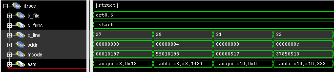

.. _rvfi:

RISC-V Formal Interface
=======================

.. note::

   A bindable RISC-V Formal Interface (RVFI) interface will be provided for |corev|. See [SYMBIOTIC-RVFI]_ for
   details on RVFI.

The module ``cv32e40x_rvfi`` can be used to create a log of the executed instructions.
It is a behavioral, non-synthesizable, module that can be bound to the ``cv32e40x_core``.

RVFI serves the following purposes:

* It can be used for formal verification.
* It can be used to produce an instruction trace during simulation.
* It can be used as a monitor to ease interfacing with an external scoreboard that itself can be interfaced to an Instruction Set Simulator (ISS) for verification reasons.

New Additions
-------------

**Debug Signals**

.. code-block:: verilog

   output [NRET * 3 - 1 : 0] rvfi_dbg
   output [NRET     - 1 : 0] rvfi_dbg_mode

Debug entry is seen by RVFI as happening between instructions. This means that neither the last instruction before debug entry nor the first instruction of the debug handler will signal any direct side-effects. The first instruction of the handler will however show the resulting state caused by these side-effects (e.g. the CSR ``rmask``/``rdata`` signals will show the updated values, ``pc_rdata`` will be at the debug handler address, etc.).

For the first instruction after entering debug, the ``rvfi_dbg`` signal contains the debug cause (see table below). The signal is otherwise 0.
The ``rvfi_dbg_mode`` signal is high if the instruction was executed in debug mode and low otherwise.

.. table:: Debug Causes
  :name: Debug Causes
  :widths: 30 20
  :class: no-scrollbar-table

  =================  =====
  Cause              Value
  =================  =====
  None                0x0
  Ebreak              0x1
  Trigger Match       0x2
  External Request    0x3
  Single Step         0x4
  =================  =====

.. note::
   ``rvfi_dbg`` will not always match ``dcsr.CAUSE`` because an ``ebreak`` in debug mode will be reported via ``rvfi_dbg``,
   whereas ``dcsr.CAUSE`` will remain unchanged for that case.

**NMI signals**

.. code-block:: verilog

   output [1:0] rvfi_nmip

Whenever |corev| has a pending NMI, the ``rvfi_nmip`` will signal this. ``rvfi_nmip[0]`` will be 1 whenever an NMI is pending, while ``rvfi_nmip[1]`` will be 0 for loads and 1 for stores.

**Memory interface signals**

|corev| RVFI memory signals ``rvfi_mem_``  are extended to support multiple memory operations per instruction and the following signals have been added:

.. code-block:: verilog

  output [ 1*NMEM-1:0] rvfi_mem_exokay,
  output [ 1*NMEM-1:0] rvfi_mem_err,
  output [ 3*NMEM-1:0] rvfi_mem_prot,
  output [ 6*NMEM-1:0] rvfi_mem_atop,
  output [ 2*NMEM-1:0] rvfi_mem_memtype,
  output [ NMEM-1  :0] rvfi_mem_dbg

**Integer register read/write**

The integer register read/write signals have been extended to support multiple register file operations per instruction.

.. code-block:: verilog

   output [32*32-1:0] rvfi_gpr_rdata,
   output [31:0]      rvfi_gpr_rmask,
   output [32*32-1:0] rvfi_gpr_wdata,
   output [31:0]      rvfi_gpr_wmask

**Instruction fetch attributes**

|corev| RVFI has been extended with the following signals for reporting attributes used when fetching an instruction.

.. code-block:: verilog

   output [2:0] rvfi_instr_prot,
   output [1:0] rvfi_instr_memtype,
   output       rvfi_instr_dbg

**rvfi_trap and rvfi_intr**

These two signals have been extended, see :ref:`rvfi_compatibility`.

.. _rvfi_compatibility:

Compatibility
-------------

This chapter specifies interpretations and compatibilities to the [SYMBIOTIC-RVFI]_.

**Interface Qualification**

All RVFI output signals are qualified with the ``rvfi_valid`` signal.
Any RVFI operation (retired or trapped instruction or trapped CLIC pointer) will set ``rvfi_valid`` high and increment the ``rvfi_order`` field.
When ``rvfi_valid`` is low, all other RVFI outputs can be driven to arbitrary values.

**Trap Signal**

The trap signal indicates that a synchronous trap has ocurred and side-effects can be expected.

.. code-block:: verilog

   output rvfi_trap_t[NRET - 1 : 0] rvfi_trap

Where the rvfi_trap_t struct contains the following fields:

.. table:: RVFI trap type
  :name: RVFI trap type
  :widths: 30 20 20
  :class: no-scrollbar-table

  =================  ===========  =======
  Field              Type         Bits
  =================  ===========  =======
  trap               logic        [0]
  exception          logic        [1]
  debug              logic        [2]
  exception_cause    logic [5:0]  [8:3]
  debug_cause        logic [2:0]  [11:9]
  cause_type         logic [1:0]  [13:12]
  clicptr            logic        [14]
  =================  ===========  =======

``rvfi_trap`` consists of 15 bits.
``rvfi_trap.trap`` is asserted if an instruction or CLIC pointer causes an exception or debug entry.
``rvfi_trap.exception`` is set for synchronous traps that do not cause debug entry. ``rvfi_trap.debug`` is set for synchronous traps that do cause debug mode entry.
``rvfi_trap.exception_cause`` provide information about non-debug traps, while ``rvfi_trap.debug_cause`` provide information about traps causing entry to debug mode.
``rvfi_trap.cause_type`` differentiates between fault causes that map to the same exception code in ``rvfi_trap.exception_cause`` and ``rvfi_trap.debug_cause``.
``rvfi_trap.clicptr`` is set for CLIC pointers. CLIC pointers are only reported on RVFI when they get an exception during fetch.
When an exception is caused by a single stepped instruction, both ``rvfi_trap.exception`` and ``rvfi_trap.debug`` will be set.
When ``rvfi_trap`` signals a trap, CSR side effects and a jump to a trap/debug handler in the next cycle can be expected.
The different trap scenarios, their expected side-effects and trap signalling are listed in the table below:

.. table:: Table of synchronous trap types
  :name: Table of synchronous trap types
  :widths: 20 10 5 5 5 5 5 5 5 10 30
  :class: no-scrollbar-table

  +------------------------------+-----------+---------------------------------------------------------------------------------+----------------------+------------------------------------------------------------------------------------------------------+
  | Scenario                     | Trap Type | rvfi_trap                                                                       | CSRs updated         | Description                                                                                          |
  |                              |           +------+-----------+-------+-----------------+-------------+------------+---------+                      |                                                                                                      |
  |                              |           | trap | exception | debug | exception_cause | debug_cause | cause_type | clicptr |                      |                                                                                                      |
  +==============================+===========+======+===========+=======+=================+=============+============+=========+======================+======================================================================================================+
  | Instruction Access Fault     | Exception | 1    | 1         | X     | 0x01            | X           | 0x0        | 0 / 1   | ``mcause``, ``mepc`` | PMA detects instruction execution from non-executable memory.                                        |
  +------------------------------+-----------+------+-----------+-------+-----------------+-------------+------------+---------+----------------------+------------------------------------------------------------------------------------------------------+
  | Illegal Instruction          | Exception | 1    | 1         | X     | 0x02            | X           | 0x0        | 0       | ``mcause``, ``mepc`` | Illegal instruction decode.                                                                          |
  +------------------------------+-----------+------+-----------+-------+-----------------+-------------+------------+---------+----------------------+------------------------------------------------------------------------------------------------------+
  | Breakpoint                   | Exception | 1    | 1         | X     | 0x03            | X           | 0x0        | 0       | ``mcause``, ``mepc`` | EBREAK executed with ``dcsr.ebreakm`` = 0.                                                           |
  +------------------------------+-----------+------+-----------+-------+-----------------+-------------+------------+---------+----------------------+------------------------------------------------------------------------------------------------------+
  | Load Address Misaligned      | Exception | 1    | 1         | X     | 0x04            | X           | 0x0        | 0       | ``mcause``, ``mepc`` | Non-naturally aligned Load-Reserved address.                                                         |
  +------------------------------+-----------+------+-----------+-------+-----------------+-------------+------------+---------+----------------------+------------------------------------------------------------------------------------------------------+
  | Load Access Fault            | Exception | 1    | 1         | X     | 0x05            | X           | 0x0        | 0       | ``mcause``, ``mepc`` | Non-naturally aligned load access attempt to an I/O region.                                          |
  |                              |           |      |           |       |                 |             +------------+---------+----------------------+------------------------------------------------------------------------------------------------------+
  |                              |           |      |           |       |                 |             | 0x1        | 0       | ``mcause``, ``mepc`` | Load-Reserved attempt to region without atomic support.                                              |
  +------------------------------+-----------+------+-----------+-------+-----------------+-------------+------------+---------+----------------------+------------------------------------------------------------------------------------------------------+
  | Store/AMO Address Misaligned | Exception | 1    | 1         | X     | 0x06            | X           | 0x0        | 0       | ``mcause``, ``mepc`` | Non-naturally aligned Store-Conditional / AMO address.                                               |
  +------------------------------+-----------+------+-----------+-------+-----------------+-------------+------------+---------+----------------------+------------------------------------------------------------------------------------------------------+
  | Store/AMO Access Fault       | Exception | 1    | 1         | X     | 0x07            | X           | 0x0        | 0       | ``mcause``, ``mepc`` | Non-naturally aligned store access attempt to an I/O region.                                         |
  |                              |           |      |           |       |                 |             +------------+---------+----------------------+------------------------------------------------------------------------------------------------------+
  |                              |           |      |           |       |                 |             | 0x1        | 0       | ``mcause``, ``mepc`` | SC or AMO attempt to region without atomic support.                                                  |
  +------------------------------+-----------+------+-----------+-------+-----------------+-------------+------------+---------+----------------------+------------------------------------------------------------------------------------------------------+
  | Environment Call             | Exception | 1    | 1         | X     | 0x0B            | X           | 0x0        | 0       | ``mcause``, ``mepc`` | ECALL executed from Machine mode.                                                                    |
  +------------------------------+-----------+------+-----------+-------+-----------------+-------------+------------+---------+----------------------+------------------------------------------------------------------------------------------------------+
  | Instruction Bus Fault        | Exception | 1    | 1         | X     | 0x18            | X           | 0x0        | 0 / 1   | ``mcause``, ``mepc`` | OBI bus error on instruction fetch.                                                                  |
  +------------------------------+-----------+------+-----------+-------+-----------------+-------------+------------+---------+----------------------+------------------------------------------------------------------------------------------------------+
  | Breakpoint to debug          | Debug     | 1    | 0         | 1     | X               | 0x1         | 0x0        | 0       | ``dpc``, ``dcsr``    | EBREAK from non-debug mode executed with ``dcsr.ebreakm`` == 1.                                      |
  +------------------------------+-----------+------+-----------+-------+-----------------+-------------+------------+---------+----------------------+------------------------------------------------------------------------------------------------------+
  | Breakpoint in debug          | Debug     | 1    | 0         | 1     | X               | 0x1         | 0x0        | 0       | No CSRs updated      | EBREAK in debug mode jumps to debug handler.                                                         |
  +------------------------------+-----------+------+-----------+-------+-----------------+-------------+------------+---------+----------------------+------------------------------------------------------------------------------------------------------+
  | Debug Trigger Match          | Debug     | 1    | 0         | 1     | X               | 0x2         | 0x0        | 0       | ``dpc``, ``dcsr``    | Debug trigger address match with ``mcontrol.timing`` = 0.                                            |
  +------------------------------+-----------+------+-----------+-------+-----------------+-------------+------------+---------+----------------------+------------------------------------------------------------------------------------------------------+
  | Single step                  | Debug     | 1    | X         | 1     | X               | 0x4         | X          | 0       | ``dpc``, ``dcsr``    | Single step.                                                                                         |
  +------------------------------+-----------+------+-----------+-------+-----------------+-------------+------------+---------+----------------------+------------------------------------------------------------------------------------------------------+

**Interrupts**

Interrupts are seen by RVFI as happening between instructions. This means that neither the last instruction before the interrupt nor the first instruction of the interrupt handler will signal any direct side-effects. The first instruction of the handler will however show the resulting state caused by these side-effects (e.g. the CSR rmask/rdata signals will show the updated values, pc_rdata will be at the interrupt handler address etc.).

.. code-block:: verilog

   output rvfi_intr_t[NRET - 1 : 0] rvfi_intr

Where the rvfi_intr_t struct contains the following fields:

.. table:: RVFI intr type
  :name: RVFI intr type
  :widths: 30 20 20
  :class: no-scrollbar-table

  =================  ============  =======
  Field              Type          Bits
  =================  ============  =======
  intr               logic         [0]
  exception          logic         [1]
  interrupt          logic         [2]
  cause              logic [10:0]  [13:3]
  =================  ============  =======

``rvfi_intr`` consists of 14 bits.
``rvfi_intr.intr`` is set for the first instruction of the trap handler when encountering an exception or interrupt.
``rvfi_intr.exception`` indicates it was caused by synchronous trap and
``rvfi_intr.interrupt`` indicates it was caused by an interrupt.
``rvfi_intr.cause`` signals the cause for entering the trap handler.

.. table:: Table of scenarios for first instruction of exception/interrupt/debug handler
  :name: Table of scenarios for first instruction of exception/interrupt/debug handler
  :widths: 60 5 5 5 10 5 5 5
  :class: no-scrollbar-table

  +-------------------------------------------------+------------------------------------------------+---------------+------------+------------+
  | Scenario                                        | rvfi_intr                                      | rvfi_dbg[2:0] | mcause[31] | dcsr[8:6]  |
  |                                                 +------+-----------+-----------+-----------------+               |            | (cause)    |
  |                                                 | intr | exception | interrupt | cause           |               |            |            |
  +=================================================+======+===========+===========+=================+===============+============+============+
  | Synchronous trap                                | 1    | 1         | 0         | Sync trap cause | 0x0           | 0          | -          |
  +-------------------------------------------------+------+-----------+-----------+-----------------+---------------+------------+------------+
  | Interrupt (includes NMIs from bus errors)       | 1    | 0         | 1         | Interrupt cause | 0x0           | 1          | -          |
  +-------------------------------------------------+------+-----------+-----------+-----------------+---------------+------------+------------+
  | Debug entry due to EBREAK (from non-debug mode) | 0    | 0         | 0         | 0x0             | 0x1           | -          | 0x1        |
  +-------------------------------------------------+------+-----------+-----------+-----------------+---------------+------------+------------+
  | Debug entry due to EBREAK (from debug mode)     | 0    | 0         | 0         | 0x0             | 0x1           | -          | -          |
  +-------------------------------------------------+------+-----------+-----------+-----------------+---------------+------------+------------+
  | Debug entry due to trigger match                | 0    | 0         | 0         | 0x0             | 0x2           | -          | 0x2        |
  +-------------------------------------------------+------+-----------+-----------+-----------------+---------------+------------+------------+
  | Debug entry due to external debug request       | X    | X         | X         | X               | 0x3 or 0x5    | X          | 0x3 or 0x5 |
  +-------------------------------------------------+------+-----------+-----------+-----------------+---------------+------------+------------+
  | Debug handler entry due to single step          | X    | X         | X         | X               | 0x4           | X          | 0x4        |
  +-------------------------------------------------+------+-----------+-----------+-----------------+---------------+------------+------------+

.. note::
   In above table the ``-`` symbol indicates an unchanged value. The ``X`` symbol indicates that multiple values are possible.

.. note::
   ``rvfi_intr`` is not set for debug traps unless a debug entry happens during the first instruction of a trap handler (see ``rvfi_intr`` == ``X`` in the table above).
   In this case CSR side-effects (to ``mepc`` and ``mcause``) can be expected as well.

**Program Counter**

The ``pc_wdata`` signal shows the predicted next program counter. This prediction ignores asynchronous traps (asynchronous debug requests and interrupts) and single step debug requests that may have happened at the same time as the instruction.

**Memory Access**

For |corev|, the ``rvfi_mem`` interface has been expanded to support multiple memory operations per instruction. The new format of the rvfi_mem signals can be seen in the code block below.

.. code-block:: verilog

   output [NRET * NMEM * XLEN   - 1 : 0] rvfi_mem_addr
   output [NRET * NMEM * XLEN/8 - 1 : 0] rvfi_mem_rmask
   output [NRET * NMEM * XLEN/8 - 1 : 0] rvfi_mem_wmask
   output [NRET * NMEM * XLEN   - 1 : 0] rvfi_mem_rdata
   output [NRET * NMEM * XLEN   - 1 : 0] rvfi_mem_wdata
   output [NRET * NMEM * 3      - 1 : 0] rvfi_mem_prot
   output [NRET * NMEM * 6      - 1 : 0] rvfi_mem_atop
   output [NRET * NMEM * 1      - 1 : 0] rvfi_mem_err
   output [NRET * NMEM * 1      - 1 : 0] rvfi_mem_exokay
   output [NRET * NMEM * 2      - 1 : 0] rvfi_mem_memtype
   output [       NMEM          - 1 : 0] rvfi_mem_dbg

Instructions will populate the ``rvfi_mem`` outputs with incrementing ``NMEM``, starting at ``NMEM=1``.

Instructions with a single memory operation (e.g. all RV32I instructions), including split misaligned transfers, will only use NMEM = 1.
Instructions with multiple memory operations (e.g. the push and pop instructions from Zcmp) use NMEM > 1 in case multiple memory operations actually occur.
``rvfi_mem_prot`` indicates the value of OBI prot used for the memory access or accesses. Note that this will be undefined upon access faults.
``rvfi_mem_memtype`` indicates the memory type attributes associated with each memory operation (i.e cacheable or bufferable). For misaligned transactions that are
split in two memory operations ``rvfi_mem_memtype`` will only report the type attribute for the first memory operation.
``rvfi_mem_atop`` indicates the type of atomic transaction as specified in [OPENHW-OBI]_.
``rvfi_mem_exokay``  indicates the status of ``data_exokay_i`` for loads, non-bufferable stores and atomic instructions (and signals 0 otherwise). For split transactions, ``rvfi_mem_exokay`` will only
be 1 if both transactions receive ``data_exokay_i == 1``.
``rvfi_mem_err`` indicates if a load, non-bufferable store or atomic instruction got a bus error (and signals 0 otherwise). :numref:`rvfi_mem_err encoding for different transaction types` shows how
different memory transactions report ``rvfi_mem_err``.

.. table:: rvfi_mem_err encoding for different transaction types
  :name: rvfi_mem_err encoding for different transaction types
  :widths: 60 5 5 5 60
  :class: no-scrollbar-table

  +---------------------+---------+----------------+----------------+--------------------------------+
  | Instruction type    | Split   | Bufferable (1) | Bufferable (2) |  rvfi_mem_err                  |
  +=====================+=========+================+================+================================+
  | Load                | No      | N/A            | N/A            | data_err_i                     |
  +---------------------+---------+----------------+----------------+--------------------------------+
  | Load                | Yes     | N/A            | N/A            | data_err_i(1) OR data_err_i(2) |
  +---------------------+---------+----------------+----------------+--------------------------------+
  | Store               | No      | No             | N/A            | data_err_i                     |
  +---------------------+---------+----------------+----------------+--------------------------------+
  | Store               | No      | Yes            | N/A            | 0                              |
  +---------------------+---------+----------------+----------------+--------------------------------+
  | Store               | Yes     | No             | No             | data_err_i(1) OR data_err_i(2) |
  +---------------------+---------+----------------+----------------+--------------------------------+
  | Store               | Yes     | Yes            | Yes            | 0                              |
  +---------------------+---------+----------------+----------------+--------------------------------+
  | Store               | Yes     | Yes            | No             | data_err_i(2)                  |
  +---------------------+---------+----------------+----------------+--------------------------------+
  | Store               | Yes     | No             | Yes            | data_err_i(1)                  |
  +---------------------+---------+----------------+----------------+--------------------------------+

``rvfi_mem_rdata`` will report the read data for load instructions. In case of split misaligned transactions this read data is the combination of the two transfers.

For cores as |corev| that support misaligned access ``rvfi_mem_addr`` will not always be 4 byte aligned. For misaligned accesses the start address of the transfer is reported (i.e. the start address of the first sub-transfer).

.. note::
  ``rvfi_mem_exokay`` and ``rvfi_mem_err`` will not be reported for bufferable writes (tied to zero). Bufferable writes may get their responses after the instructions have retired.

.. note::
  RVFI for |corev| currently has limited support for AMO instructions.
  AMO instructions will only set ``rvfi_mem_wmask`` and not ``rvfi_mem_rmask``.
  The value written to memory by AMO (read-modify-write) instructions is modified outside of |corev| before being written to memory. This results in the value of ``rvfi_mem_wdata`` to not reflect the value written to memory.
  See :ref:`amo_operations` for details on AMO instructions.

**CSR Signals**

To reduce the number of signals in the RVFI interface, a vectorized CSR interface has been introduced for register ranges.

.. code-block:: verilog

   output [<NUM_CSRNAME>-1:0] [NRET * XLEN - 1 : 0] rvfi_csr_<csrname>_rmask
   output [<NUM_CSRNAME>-1:0] [NRET * XLEN - 1 : 0] rvfi_csr_<csrname>_wmask
   output [<NUM_CSRNAME>-1:0] [NRET * XLEN - 1 : 0] rvfi_csr_<csrname>_rdata
   output [<NUM_CSRNAME>-1:0] [NRET * XLEN - 1 : 0] rvfi_csr_<csrname>_wdata

Example:

.. code-block:: verilog

   output [31:0] [31:0] rvfi_csr_name_rmask
   output [31:0] [31:0] rvfi_csr_name_wmask
   output [31:0] [31:0] rvfi_csr_name_rdata
   output [31:0] [31:0] rvfi_csr_name_wdata

Instead of:

.. code-block:: verilog

   output [31:0] rvfi_csr_name0_rmask
   output [31:0] rvfi_csr_name0_wmask
   output [31:0] rvfi_csr_name0_rdata
   output [31:0] rvfi_csr_name0_wdata
   . . .
   output [31:0] rvfi_csr_name31_rmask
   output [31:0] rvfi_csr_name31_wmask
   output [31:0] rvfi_csr_name31_rdata
   output [31:0] rvfi_csr_name31_wdata

**CSR mnxti**

CSR accesses to the ``mnxti`` CSR do a read-modify-write on the ``mstatus`` CSR, and return a pointer address if there is a pending non-SHV CLIC interrupt.
If there is a pending non-SHV CLIC interrupt, it also updates ``mintstatus`` and ``mcause``.
To reflect this behavior, the ``rvfi_csr_mnxti*`` outputs for ``mnxti`` have a different semantic than other CSRs.

The ``rvfi_csr_mnxti*``  is reported as follows on RVFI:

  * The ``rmask`` will always be all ones as for other CSRs.
  * The ``wmask`` will be all ones whenever the CSR instruction actually writes to ``mstatus``.
  * The ``wdata`` will be the data written to ``mstatus``.
  * The ``rdata`` will report a pointer address if an interrupt is pending, or 0 if no interrupt is pending.

Note that the ``rvfi_csr_mstatus*`` will also reflect the access to ``mstatus`` due to an ``mnxti`` access.
In case the access to ``mnxti`` returns a valid pointer address, the ``rvfi_csr_mintstatus*`` and ``rvfi_csr_mcause*`` will also have values showing the side effects of accessing ``mnxti``.

**GPR signals**

For |corev|, RVFI has been expanded to allow reporting multiple register file operations per instruction (more than two reads and one write).
The interface is defined as follows:

.. code-block:: verilog

   output [NRET * 32 * XLEN - 1 : 0] rvfi_gpr_rdata
   output [NRET * 32 -1 : 0]         rvfi_gpr_rmask
   output [NRET * 32 * XLEN - 1 : 0] rvfi_gpr_wdata
   output [NRET * 32 -1 : 0]         rvfi_gpr_wmask

The outputs ``rvfi_gpr_rdata`` and ``rvfi_gpr_wdata`` reflect the entire register file, with each XLEN field of the vector representing one GPR, with [x0] starting at index [XLEN - 1 : 0], [x1] at index [2*XLEN-1 -: XLEN] and so on.
Each bit in the outputs ``rvfi_gpr_rmask`` and ``rvfi_gpr_wmask`` indicates if a GPR has been read or written during an instruction. The index of the bit indicates the address of the GPR accessed. Entries in ``rvfi_gpr_rdata``
and ``rvfi_gpr_wdata`` are only considered valid if the corresponding bit in the ``rvfi_gpr_rmask`` or ``rvfi_gpr_wmask`` is set.

**Machine Counter/Timers**

In contrast to [SYMBIOTIC-RVFI]_, the **mcycle[h]** and **minstret[h]** registers are not modelled as happening "between instructions" but rather as a side-effect of the instruction.
This means that an instruction that causes an increment (or decrement) of these counters will set the ``rvfi_csr_mcycle_wmask``, and that ``rvfi_csr_mcycle_rdata`` is not necessarily equal to ``rvfi_csr_mcycle_wdata``.

**Halt Signal**

The ``rvfi_halt`` signal is meant for liveness properties of cores that can halt execution. It is only needed for cores that can lock up. Tied to 0 for RISC-V compliant cores.

**Mode Signal**

The ``rvfi_mode`` signal shows the *current* privilege mode as opposed to the *effective* privilege mode of the instruction. I.e. for load and store instructions the reported privilege level will therefore not depend on ``mstatus.mpp`` and ``mstatus.mprv``.

**OBI prot Signal**

``rvfi_instr_prot`` indicates the value of OBI prot used for fetching the retired instruction. Note that this will be undefined upon access faults.

Simulation trace
-----------------

The module ``cv32e40x_rvfi_sim_trace`` can be bound to ``cv32e40x_rvfi`` to enable tracing capabilities.
``cv32e40x_rvfi_sim_trace`` supports trace output to log file and trace annotation in waveforms.

Trace annotation in waveforms is enabled by providing the path to an .itb file through the simulation plusarg ``itb_file``. The name of the plusarg can be overridden through the ``cv32e40x_rvfi_sim_trace`` parameter ``ITB_PLUSARG``.
The struct ``itrace`` in ``cv32e40x_rvfi_sim_trace`` will contain information about the most recently retired instruction.

Trace output to log is enabled by providing log file path through the simulation plusarg ``log_file``. The name of the plusarg can be overridden through the ``cv32e40x_rvfi_sim_trace`` parameter ``LOGFILE_PATH_PLUSARG``.

Trace output format
-------------------

The trace log file format is as described below.

1.  **pc**: The program counter
2.  **rs1(data)** Register read port 1 source register and read data
3.  **rs2(data)** Register read port 2 source register and read data
4.  **rd(data)**  Register write port 1 destination register and write data
5.  **memaddr** Memory address for instructions accessing memory
6.  **rmask** Bitmask specifying which bytes in ``rdata`` contain valid read data
7.  **rdata** The data read from memory address specified in ``memaddr``
8.  **wmask** Bitmask specifying which bytes in ``wdata`` contain valid write data
9.  **wdata** The data written to memory address specified in ``memaddr``
10. **Assembly** Assembly code. This column is only populated if an itb file is provided

.. code-block:: text

   pc         | rs1 (   data   ) | rs2 (   data   ) | rd  (   data   ) | memaddr    | rmask  | rdata      | wmask  | wdata      ||  Assembly
   0x00000080 | x0  (0x00000000) | x0  (0x00000000) | x3  (0x00013080) | 0x00013080 | 0x0000 | 0x00000000 | 0x0000 | 0x00000000 ||   auipc x3,0x13
   0x00000084 | x3  (0x00013080) | x0  (0x00000000) | x3  (0x00013610) | 0x00013610 | 0x0000 | 0x00000000 | 0x0000 | 0x00000000 ||   addi x3,x3,1424
   0x00000088 | x0  (0x00000000) | x0  (0x00000000) | x10 (0x00000088) | 0x00000088 | 0x0000 | 0x00000000 | 0x0000 | 0x00000000 ||   auipc x10,0x0
   0x0000008c | x10 (0x00000088) | x0  (0x00000000) | x10 (0x00000400) | 0x00000400 | 0x0000 | 0x00000000 | 0x0000 | 0x00000000 ||   addi x10,x10,888

The waveform annotation for the same trace is depicted below:

