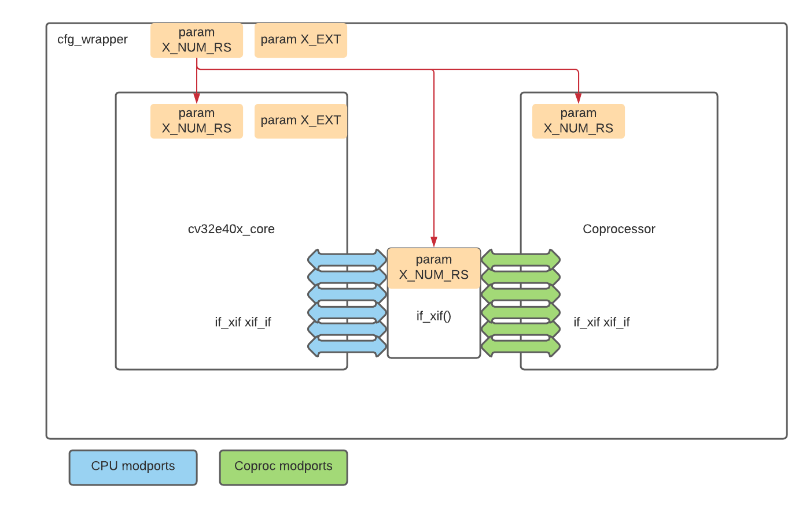
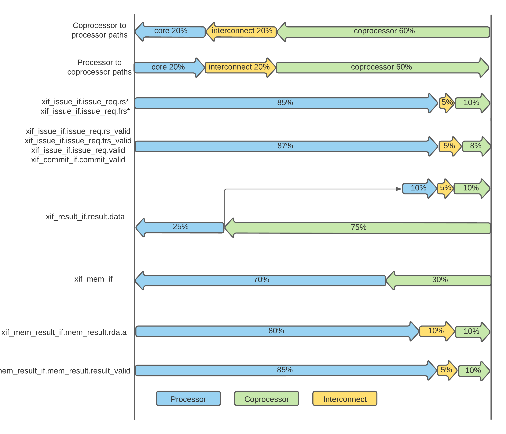

.. _x_ext:

eXtension Interface
===================

The eXtension interface, also called ``CORE-V-XIF``, enables extending |corev| with (custom or standardized) instructions without the need to change the RTL
of |corev| itself. Extensions can be provided in separate modules external to |corev| and are integrated
at system level by connecting them to the eXtension interface.

The eXtension interface provides low latency (tightly integrated) read and write access to the |corev| register file.
All opcodes which are not used (i.e. considered to be invalid) by |corev| can be used for extensions. It is recommended
however that custom instructions do not use opcodes that are reserved/used by RISC-V International.

The eXtension interface enables extension of |corev| with:

* Custom ALU type instructions.
* Custom load/store type instructions.
* Custom CSRs and related instructions.

Control-Tranfer type instructions (e.g. branches and jumps) are not supported via the eXtension interface.

.. note::

   |corev| does for example not implement the **F** (single-precision floating-point), **P** (Packed SIMD) or
   **V** (Vector) extensions internal to the core. Such extensions are considered good candidates to be implemented
   as external coprocessor functionality connected via the eXtension interface.

CORE-V-XIF
----------

The eXtension interface of complies to the [OPENHW-XIF]_ specification. The reader is deferred to [OPENHW-XIF]_ for explanation of the
interface protocol and semantics. Here we only list the top level interface pins to clarify the mapping of |corev|'s SystemVerilog interfaces
to |corev| signals.

.. _x_compressed_if:

Compressed interface
~~~~~~~~~~~~~~~~~~~~
:numref:`Compressed interface signals` describes the compressed interface signals.

.. table:: Compressed interface signals
  :name: Compressed interface signals

  +--------------------------------------------+---------------------+-----------------+------------------------------------------------------------------------------------------------------------------------------+                           
  | **Signal**                                 | **Type**            | **Direction**   | **Description**                                                                                                              |                           
  +--------------------------------------------+---------------------+-----------------+------------------------------------------------------------------------------------------------------------------------------+                           
  | ``xif_compressed_if.compressed_valid``     | logic               | output          | Compressed request valid. Request to uncompress a compressed instruction.                                                    |                           
  +--------------------------------------------+---------------------+-----------------+------------------------------------------------------------------------------------------------------------------------------+                           
  | ``xif_compressed_if.compressed_ready``     | logic               | input           | Compressed request ready. The transactions signaled via ``compressed_req`` and ``compressed_resp`` are accepted when         |                           
  |                                            |                     |                 | ``compressed_valid`` and  ``compressed_ready`` are both 1.                                                                   |                           
  +--------------------------------------------+---------------------+-----------------+------------------------------------------------------------------------------------------------------------------------------+                           
  | ``xif_compressed_if.compressed_req``       | x_compressed_req_t  | output          | Compressed request packet.                                                                                                   |                           
  +--------------------------------------------+---------------------+-----------------+------------------------------------------------------------------------------------------------------------------------------+                           
  | ``xif_compressed_if.compressed_resp``      | x_compressed_resp_t | input           | Compressed response packet.                                                                                                  |                           
  +--------------------------------------------+---------------------+-----------------+------------------------------------------------------------------------------------------------------------------------------+                           

.. _x_issue_if:

Issue interface
~~~~~~~~~~~~~~~
:numref:`Issue interface signals` describes the issue interface signals.                                                                                                                                                         

.. table:: Issue interface signals                                                                                                                                                                                               
  :name: Issue interface signals                                                                                                                                                                                                 

  +--------------------------------------------+-----------------+-----------------+------------------------------------------------------------------------------------------------------------------------------+                               
  | **Signal**                                 | **Type**        | **Direction**   | **Description**                                                                                                              |                               
  +--------------------------------------------+-----------------+-----------------+------------------------------------------------------------------------------------------------------------------------------+                               
  | ``xif_issue_if.issue_valid``               | logic           | output          | Issue request valid. Indicates that |corev| wants to offload an instruction.                                                 |                               
  +--------------------------------------------+-----------------+-----------------+------------------------------------------------------------------------------------------------------------------------------+                               
  | ``xif_issue_if.issue_ready``               | logic           | input           | Issue request ready. The transaction signaled via ``issue_req`` and ``issue_resp`` is accepted when                          |                               
  |                                            |                 |                 | ``issue_valid`` and  ``issue_ready`` are both 1.                                                                             |                               
  +--------------------------------------------+-----------------+-----------------+------------------------------------------------------------------------------------------------------------------------------+                               
  | ``xif_issue_if.issue_req``                 | x_issue_req_t   | output          | Issue request packet.                                                                                                        |                               
  +--------------------------------------------+-----------------+-----------------+------------------------------------------------------------------------------------------------------------------------------+                               
  | ``xif_issue_if.issue_resp``                | x_issue_resp_t  | input           | Issue response packet.                                                                                                       |                               
  +--------------------------------------------+-----------------+-----------------+------------------------------------------------------------------------------------------------------------------------------+                               

.. _x_commit_if:

Commit interface
~~~~~~~~~~~~~~~~
:numref:`Commit interface signals` describes the commit interface signals.                                                                                                                                                       

.. table:: Commit interface signals                                                                                                                                                                                              
  :name: Commit interface signals                                                                                                                                                                                                

  +--------------------------------------------+-----------------+-----------------+------------------------------------------------------------------------------------------------------------------------------+                               
  | **Signal**                                 | **Type**        | **Direction**   | **Description**                                                                                                              |                               
  +--------------------------------------------+-----------------+-----------------+------------------------------------------------------------------------------------------------------------------------------+                               
  | ``xif_commit_if.commit_valid``             | logic           | output          | Commit request valid. Indicates that |corev| has valid commit or kill information for an offloaded instruction.              |                               
  |                                            |                 |                 | There is no corresponding ready signal (it is implicit and assumed 1). The coprocessor shall be ready                        |                               
  |                                            |                 |                 | to observe the ``commit_valid`` and ``commit_kill`` signals at any time coincident or after an issue transaction             |                               
  |                                            |                 |                 | initiation.                                                                                                                  |                               
  +--------------------------------------------+-----------------+-----------------+------------------------------------------------------------------------------------------------------------------------------+                               
  | ``xif_commit_if.commit``                   | x_commit_t      | output          | Commit packet.                                                                                                               |                               
  +--------------------------------------------+-----------------+-----------------+------------------------------------------------------------------------------------------------------------------------------+                               

.. _x_mem_if:

Memory (request/response) interface                                                                                                                                                                                              
~~~~~~~~~~~~~~~~~~~~~~~~~~~~~~~~~~~                                                                                                                                                                                              
:numref:`Memory (request/response) interface signals` describes the memory (request/response) interface signals.                                                                                                                 

.. table:: Memory (request/response) interface signals                                                                                                                                                                           
  :name: Memory (request/response) interface signals                                                                                                                                                                             

  +--------------------------------------------+-----------------+-----------------+------------------------------------------------------------------------------------------------------------------------------+                               
  | **Signal**                                 | **Type**        | **Direction**   | **Description**                                                                                                              |                               
  +--------------------------------------------+-----------------+-----------------+------------------------------------------------------------------------------------------------------------------------------+                               
  | ``xif_mem_if.mem_valid``                   | logic           | input           | Memory (request/response) valid. Indicates that the coprocessor wants to perform a memory transaction for an                 |                               
  |                                            |                 |                 | offloaded instruction.                                                                                                       |                               
  +--------------------------------------------+-----------------+-----------------+------------------------------------------------------------------------------------------------------------------------------+                               
  | ``xif_mem_if.mem_ready``                   | logic           | output          | Memory (request/response) ready. The memory (request/response) signaled via ``mem_req`` is accepted by |corev| when          |                               
  |                                            |                 |                 | ``mem_valid`` and  ``mem_ready`` are both 1.                                                                                 |                               
  +--------------------------------------------+-----------------+-----------------+------------------------------------------------------------------------------------------------------------------------------+                               
  | ``xif_mem_if.mem_req``                     | x_mem_req_t     | input           | Memory request packet.                                                                                                       |                               
  +--------------------------------------------+-----------------+-----------------+------------------------------------------------------------------------------------------------------------------------------+                               
  | ``xif_mem_if.mem_resp``                    | x_mem_resp_t    | output          | Memory response packet. Response to memory request (e.g. PMA check response). Note that this is not the memory result.       |                               
  +--------------------------------------------+-----------------+-----------------+------------------------------------------------------------------------------------------------------------------------------+                               

.. _x_mem_result_if:

Memory result interface
~~~~~~~~~~~~~~~~~~~~~~~
:numref:`Memory result interface signals` describes the memory result interface signals.                                                                                                                                         

.. table:: Memory result interface signals                                                                                                                                                                                       
  :name: Memory result interface signals                                                                                                                                                                                         

  +--------------------------------------------+-----------------+-----------------+------------------------------------------------------------------------------------------------------------------------------+                               
  | **Signal**                                 | **Type**        | **Direction**   | **Description**                                                                                                              |                               
  +--------------------------------------------+-----------------+-----------------+------------------------------------------------------------------------------------------------------------------------------+                               
  | ``xif_mem_result_if.mem_result_valid``     | logic           | output          | Memory result valid. Indicates that |corev| has a valid memory result for the corresponding memory request.                  |                               
  |                                            |                 |                 | There is no corresponding ready signal (it is implicit and assumed 1). The coprocessor must be ready to accept               |                               
  |                                            |                 |                 | ``mem_result`` whenever ``mem_result_valid`` is 1.                                                                           |                               
  +--------------------------------------------+-----------------+-----------------+------------------------------------------------------------------------------------------------------------------------------+                               
  | ``xif_mem_result_if.mem_result``           | x_mem_result_t  | output          | Memory result packet.                                                                                                        |                               
  +--------------------------------------------+-----------------+-----------------+------------------------------------------------------------------------------------------------------------------------------+                               

.. _x_result_if:

Result interface
~~~~~~~~~~~~~~~~
:numref:`Result interface signals` describes the result interface signals.                                                                                                                                                       

.. table:: Result interface signals                                                                                                                                                                                              
  :name: Result interface signals                                                                                                                                                                                                

  +--------------------------------------------+-----------------+-----------------+------------------------------------------------------------------------------------------------------------------------------+                               
  | **Signal**                                 | **Type**        | **Direction**   | **Description**                                                                                                              |                               
  +--------------------------------------------+-----------------+-----------------+------------------------------------------------------------------------------------------------------------------------------+                               
  | ``xif_result_if.result_valid``             | logic           | input           | Result request valid. Indicates that the coprocessor has a valid result (write data or exception) for an offloaded           |                               
  |                                            |                 |                 | instruction.                                                                                                                 |                               
  +--------------------------------------------+-----------------+-----------------+------------------------------------------------------------------------------------------------------------------------------+                               
  | ``xif_result_if.result_ready``             | logic           | output          | Result request ready. The result signaled via ``result`` is accepted by the core when                                        |                               
  |                                            |                 |                 | ``result_valid`` and  ``result_ready`` are both 1.                                                                           |                               
  +--------------------------------------------+-----------------+-----------------+------------------------------------------------------------------------------------------------------------------------------+                               
  | ``xif_result_if.result``                   | x_result_t      | input           | Result packet.                                                                                                               |                               
  +--------------------------------------------+-----------------+-----------------+------------------------------------------------------------------------------------------------------------------------------+                               

Integration
-----------

When integrating the eXtension interface, all parameters used by both |corev|, the SystemVerilog interface and the coprocessor/interconnect must match.
Parameters or localparams should be used at the hierarchy level above |corev| as shown in :numref:`xif-integration`.

   eXtenstion interface integration

Timing
------

For optimal system level performance |corev|, the coprocessor(s) and the optional interconnect are advised to adhere to the
timing budgets shown in :numref:`xif-timing-budgets`.

All eXtension interface signals not explicitly covered in :numref:`xif-timing-budgets` should follow the generic timing budget that is
outlined - 20% for the processor, 20% for the interconnect and 60% for the coprocessor.

The |corev| github repository contains a constraints file as seen from the processor: `cv32e40x_core.sdc <https://github.com/openhwgroup/cv32e40x/blob/master/constraints/cv32e40x_core.sdc>`_

   eXtenstion interface timing budgets
